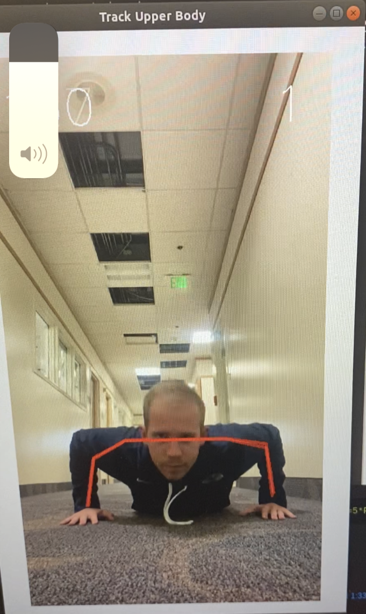

# Pushup Counter with OpenCV

## Pushup Counter uses OpenCV body position landmarks to know when a pushup is completed with proper form. It currently calculates the angle of the right elbox using the 2 vectors from elbow to shoulder and elbow to wrist landmarks. The colors represent the state of the pushup:

Yellow - Not ready to start counting

Blue - Measuring if pushup in downward motion

Red - Measuring pushup if in upward motion

The state will not switch from Blue to Red unless proper form is used for the pushup.

## To begin, remain in pushup position for 4 seconds until the body tracker turns from yellow to blue.

## Once blue, you may begin doing pushups.

## It will turn red when you go far enough down but won't turn blue unless you go all the way up, and vice versa. The pushup is not counted until you go back up to the top starting position. In this case below, I am completing my second pushup.

